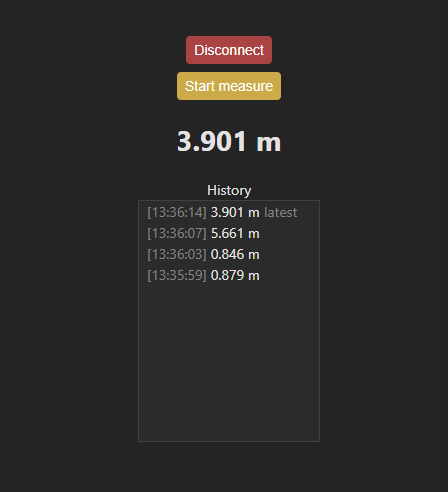

# fnirsi-ir40-webtool

Simple rangefinder web client. Currently it can read only linear measurements from FNIRSI-IR40 in meters.



## Protocol info

Packets from device:

```
change parameters:
00 07 02 06 14 00 00 00 00 unit m
00 07 02 06 14 00 00 00 01 unit ft
00 07 02 06 14 00 00 00 02 unit in
00 07 02 0A 14 00 00 00 00 measure from top
00 07 02 0A 14 00 00 00 01 measure from back

measure:
00 15 02 01 14 00 00 00 00 02 05 14 00 00 00 79 02 06 14 00 00 00 00 - linear 0.121m
00 15 02 01 14 00 00 00 00 02 05 14 00 00 03 D6 02 06 14 00 00 00 00 - linear 0.982m
00 15 02 01 14 00 00 00 00 02 05 14 00 00 15 E6 02 06 14 00 00 00 00 - linear 5.606m
00 23 02 01 14 00 00 00 03 02 02 14 00 00 00 D9 02 03 14 00 00 00 FB 02 05 14 00 00 00 36 02 06 14 00 00 00 00 - rect 0.217 * 0.251 = 0.054

status:
00 0E 02 06 14 00 00 00 00 02 0A 14 00 00 00 01 - m
00 0E 02 06 14 00 00 00 01 02 0A 14 00 00 00 01 - ft
00 0E 02 06 14 00 00 00 02 02 0A 14 00 00 00 01 - in
```

Packets to device:

```
00 07 02 08 0e 00 00 00 01 - start continuous measure
00 07 02 08 0e 00 00 00 00 - stop continuous measure
```